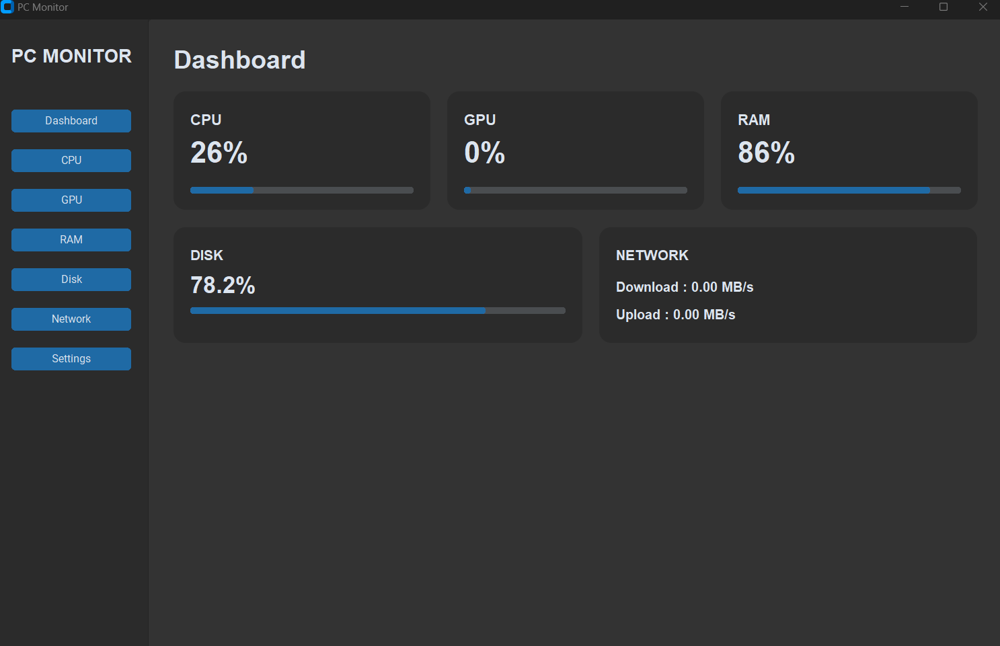
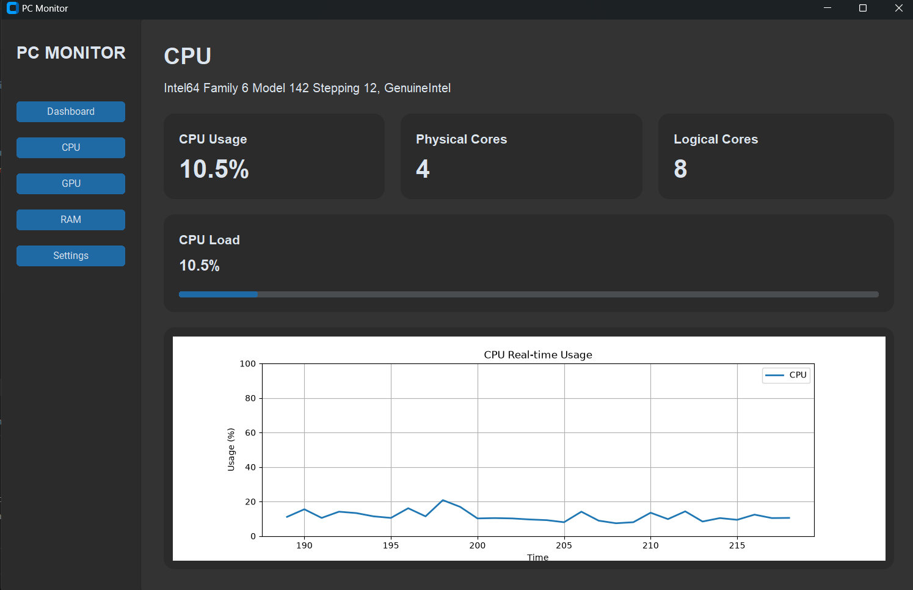
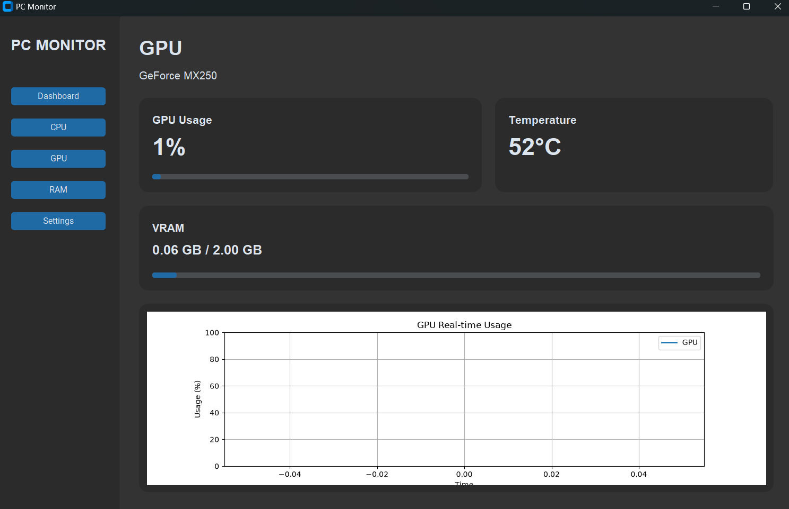
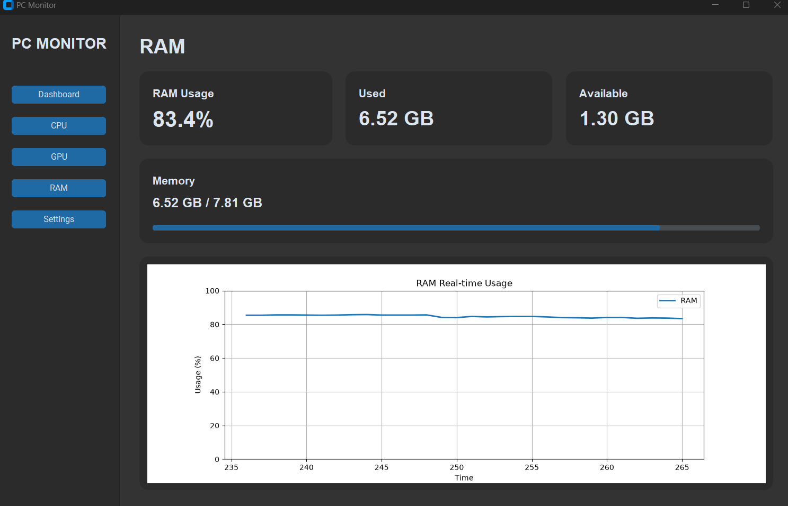
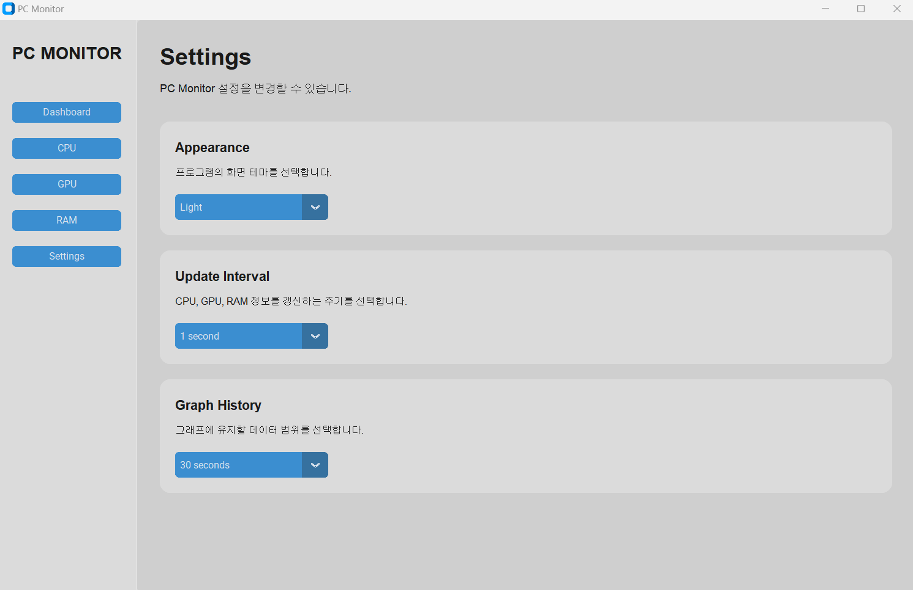
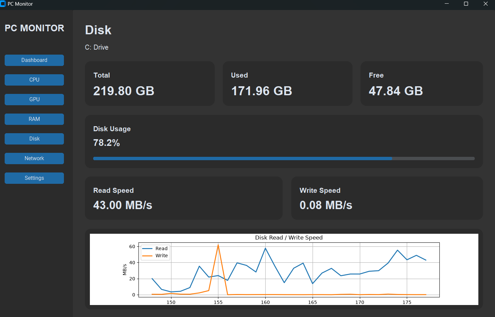
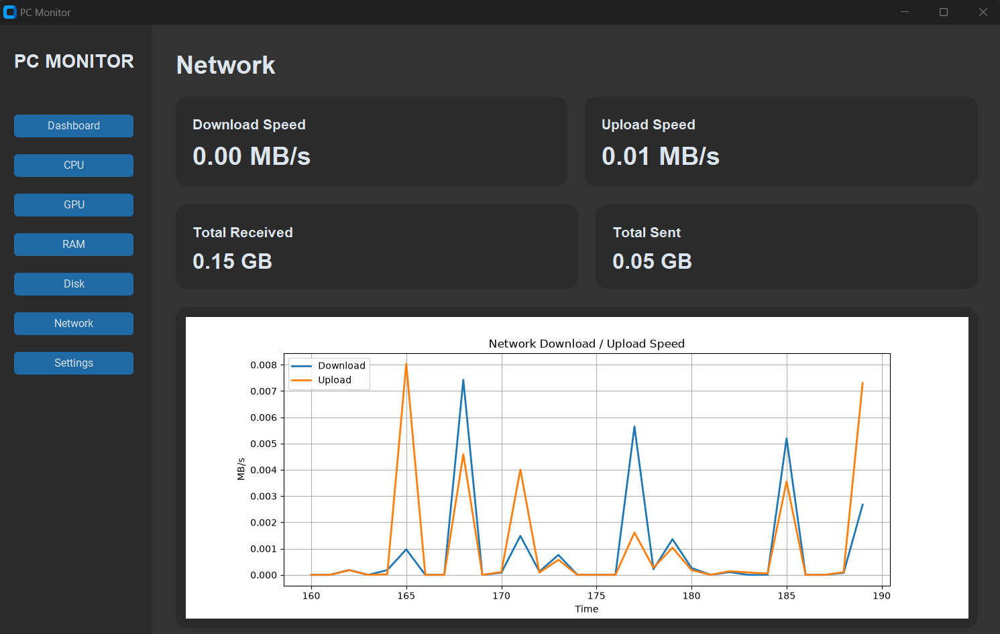
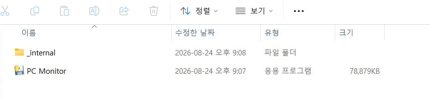
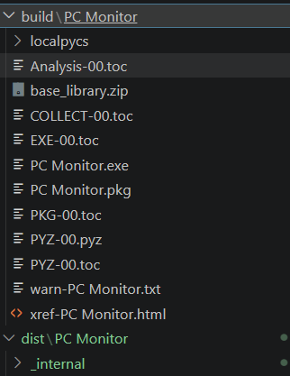
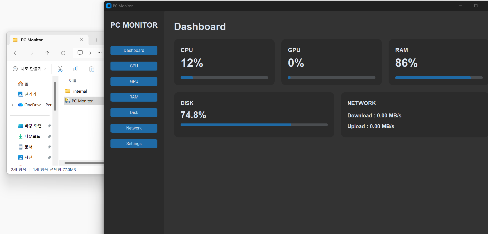

# PC Monitor

Python으로 개발한 **실시간 PC 성능 모니터링 데스크톱 애플리케이션**입니다.

CPU, NVIDIA GPU, RAM, Disk, Network의 상태를 실시간으로 수집하고,
각 시스템 자원의 사용량을 Progress Bar와 그래프를 통해 시각적으로 확인할 수 있도록 구현했습니다.

`CustomTkinter`를 활용하여 Dashboard와 하드웨어별 상세 모니터링 페이지를 구성했으며,
Settings 페이지를 통해 테마, 업데이트 주기, 그래프 데이터 범위를 변경할 수 있습니다.

또한 시스템 정보 조회 과정에서 오류가 발생해도 프로그램 전체가 종료되지 않도록
각 모니터링 기능에 예외 처리를 적용했습니다.

> 주요 모니터링 기능 구현과 Windows 실행 파일 패키징을 완료한 PC Monitor v1.0입니다.

---

## Key Features

### Dashboard

PC의 주요 시스템 상태를 한 화면에서 빠르게 확인할 수 있는 메인 Dashboard입니다.

- CPU 사용률
- NVIDIA GPU 사용률
- RAM 사용률
- Disk 사용률
- Network Download 속도
- Network Upload 속도
- 실시간 Progress Bar
- 시스템 상태 실시간 업데이트

Dashboard를 통해 각 상세 페이지에 들어가지 않아도
현재 시스템의 주요 자원 상태를 한눈에 확인할 수 있습니다.

---

### CPU Monitoring

CPU의 기본 정보와 실시간 사용률을 확인할 수 있습니다.

#### 제공 정보

- CPU 이름
- CPU 사용률
- 물리 코어 수
- 논리 코어 수
- CPU 사용률 Progress Bar
- 실시간 CPU 사용률 그래프

CPU 정보는 `psutil`과 `platform`을 이용하여 수집합니다.

---

### GPU Monitoring

NVIDIA GPU의 상태를 실시간으로 모니터링합니다.

#### 제공 정보

- NVIDIA GPU 이름
- GPU 사용률
- GPU 온도
- VRAM 사용량
- 전체 VRAM 용량
- GPU 사용률 Progress Bar
- VRAM Progress Bar
- 실시간 GPU 사용률 그래프

GPU 정보는 **NVIDIA NVML**을 사용하여 수집합니다.

일부 GPU 또는 Driver 환경에서는 특정 NVML 정보 조회가 실패할 수 있기 때문에,
GPU 사용률 또는 온도를 정상적으로 가져오지 못한 경우 `N/A`로 표시하도록 처리했습니다.

GPU 정보 조회 오류가 발생하더라도 프로그램 전체가 종료되지 않도록 예외 처리를 적용했습니다.

---

### RAM Monitoring

시스템 메모리 상태를 실시간으로 확인할 수 있습니다.

#### 제공 정보

- RAM 사용률
- 전체 RAM 용량
- 사용 중인 RAM
- 사용 가능한 RAM
- RAM 사용률 Progress Bar
- 실시간 RAM 사용률 그래프

RAM 정보는 `psutil.virtual_memory()`를 이용하여 수집합니다.

---

### Disk Monitoring

Windows 시스템의 Disk 상태를 실시간으로 확인할 수 있습니다.

#### 제공 정보

- Disk 전체 용량
- Disk 사용량
- Disk 여유 공간
- Disk 사용률
- Disk Read 속도
- Disk Write 속도
- Disk 사용률 Progress Bar
- 실시간 Disk Read / Write 그래프

Disk Read / Write 속도는 누적 I/O 값을 주기적으로 비교하여
초당 데이터 처리량을 계산하는 방식으로 구현했습니다.

---

### Network Monitoring

시스템의 Network 송수신 상태를 실시간으로 확인할 수 있습니다.

#### 제공 정보

- 실시간 Download 속도
- 실시간 Upload 속도
- 누적 수신 데이터
- 누적 송신 데이터
- 실시간 Download / Upload 그래프

`psutil.net_io_counters()`에서 제공하는 누적 송수신 데이터를 이용하여
이전 측정값과 현재 측정값의 차이를 계산하고 실시간 속도를 구합니다.

---

## Settings

프로그램의 동작과 화면 관련 설정을 변경할 수 있습니다.

### Appearance

프로그램의 화면 테마를 변경할 수 있습니다.

- Dark
- Light
- System

### Update Interval

시스템 정보를 가져오는 주기를 변경할 수 있습니다.

- 0.5 second
- 1 second
- 2 seconds

### Graph History

실시간 그래프에 유지할 데이터 개수를 변경할 수 있습니다.

- 30
- 60
- 120

설정값은 `config.py`에서 관리하며
각 모니터링 페이지에서 공통으로 사용할 수 있도록 구성했습니다.

---

## Tech Stack

| Category | Technology |
|---|---|
| Language | Python |
| GUI | CustomTkinter / Tkinter |
| System Monitoring | psutil |
| GPU Monitoring | NVIDIA NVML (`nvidia-ml-py`) |
| Data Visualization | Matplotlib |
| Packaging | PyInstaller |
| Version Control | Git |
| Repository | GitHub |

---

## Project Structure

```text
pc_performance_monitor_program/
│
├── main.py
├── monitor.py
├── config.py
├── requirements.txt
├── README.md
├── .gitignore
├── PC Monitor.spec
│
├── ui/
│   ├── __init__.py
│   ├── Dashboard.py
│   ├── CPU_page.py
│   ├── GPU_page.py
│   ├── RAM_page.py
│   ├── disk_page.py
│   ├── network_page.py
│   └── settings.py
│
├── result/
│   ├── dashboard2.png
│   ├── cpu.png
│   ├── gpu.png
│   ├── ram.png
│   ├── disk.png
│   ├── network.png
│   ├── settings.png
│   ├── exe.png
│   ├── run.png
│   └── run2.png
│
├── build/
│   └── PC Monitor/
│       └── ...
│
└── dist/
    └── PC Monitor/
        ├── PC Monitor.exe
        └── _internal/
```

`build/`와 `dist/`는 PyInstaller 실행 시 생성되는 빌드 결과물이며,
Git 저장소에서는 `.gitignore`를 통해 제외하도록 설정했습니다.

---

## Windows Build

PyInstaller를 사용하여 Windows 실행 파일을 생성했습니다.

처음에는 `onefile` 방식으로 패키징했지만,
실행 시 압축 해제 과정으로 인해 시작 속도가 느려
최종적으로 `onedir` 방식을 사용했습니다.

현재 빌드 명령어는 다음과 같습니다.

```bash
pyinstaller --noconfirm --onedir --windowed --name "PC Monitor" main.py
```

빌드가 완료되면 다음 경로에 실행 파일이 생성됩니다.

```text
dist/
└── PC Monitor/
    ├── PC Monitor.exe
    └── _internal/
```

`PC Monitor.exe`와 `_internal` 폴더는 함께 있어야 하며,
`PC Monitor.exe`를 실행하면 별도의 `python main.py` 명령 없이
Windows 데스크톱 애플리케이션 형태로 실행할 수 있습니다.

---

## Exception Handling

시스템 정보를 조회하는 과정에서 오류가 발생해도
프로그램 전체가 종료되지 않도록 예외 처리를 적용했습니다.

현재 예외 처리가 적용된 영역은 다음과 같습니다.

- CPU 정보 조회
- RAM 정보 조회
- NVIDIA GPU 정보 조회
- Disk 정보 조회
- Network 정보 조회

특히 GPU 정보는 NVIDIA NVML을 사용하기 때문에
GPU 또는 Driver 환경에 따라 일부 정보 조회가 실패할 수 있습니다.

이 경우 프로그램 전체를 종료하지 않고 다음과 같이 처리합니다.

- GPU 이름 조회 실패 시 기본값 표시
- GPU 사용률 조회 실패 시 `N/A` 표시
- GPU 온도 조회 실패 시 `N/A` 표시
- VRAM 조회 실패 시 기본값 반환
- 마지막 정상 측정값을 활용하여 일시적인 NVML 오류 대응

이를 통해 특정 하드웨어 정보를 가져오지 못하더라도
나머지 모니터링 기능은 계속 사용할 수 있도록 구성했습니다.

---

## Development Status

현재 구현된 기능:

- Dashboard
- CPU 상세 모니터링
- GPU 상세 모니터링
- RAM 상세 모니터링
- Disk 상세 모니터링
- Network 상세 모니터링
- CPU 실시간 그래프
- GPU 실시간 그래프
- RAM 실시간 그래프
- Disk Read / Write 그래프
- Network Download / Upload 그래프
- Dark / Light / System 테마
- Update Interval 설정
- Graph History 설정
- 시스템 정보 조회 예외 처리
- NVIDIA NVML 오류 처리
- Windows 실행 파일 패키징
- PyInstaller `onedir` 방식 빌드
- Git / GitHub 버전 관리wnstj5694!


---

## Result Screenshot

### Dashboard Result



### CPU Result



### GPU Result



### RAM Result



### Settings Result



### Disk Result



### Network Result



### Executable Result



### dist build folder


---

## Final Result

PC Monitor v1.0의 최종 실행 화면입니다.



---

## Planned Features

향후 프로젝트를 확장할 경우 다음 기능을 추가할 수 있습니다.

- 프로세스별 CPU / RAM 사용량
- 설정값 영구 저장
- 다중 GPU 지원
- 시스템 상세 정보 페이지
- 프로그램 아이콘 적용
- 배포용 UI 추가 개선